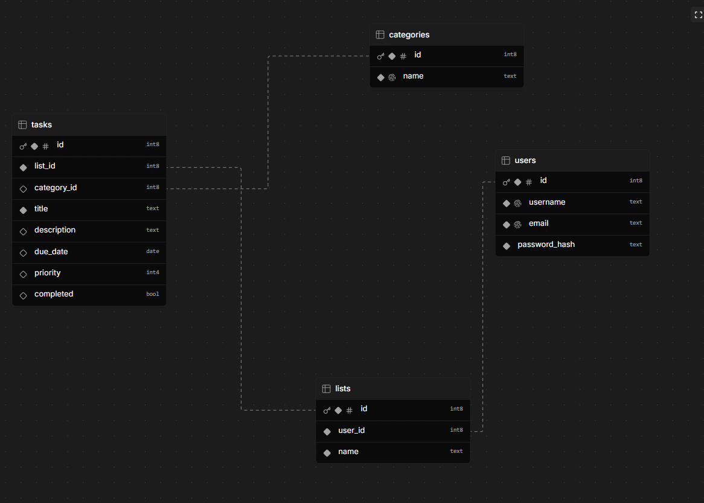

# Task List Management System Database Design

## Overview
This document outlines the database design for the Task List Management System, including table structures, relationships, and key design decisions.

## Database Schema

### Models

#### User
- Primary key: `id` (Int, auto-increment)
- Fields:
  - `username` (String)
  - `email` (String, unique)
  - `password_hash` (String)
  - `role` (Enum: ADMIN, NORMAL)
  - `createdAt` (DateTime)
  - `updatedAt` (DateTime)

#### Lists
- Primary key: `id` (Int, auto-increment)
- Fields:
  - `user_id` (Int, foreign key)
  - `name` (String, unique)
  - `createdAt` (DateTime)
  - `updatedAt` (DateTime)

#### Categories
- Primary key: `id` (Int, auto-increment)
- Fields:
  - `name` (String, unique)
  - `createdAt` (DateTime)
  - `updatedAt` (DateTime)

#### Tasks
- Primary key: `id` (Int, auto-increment)
- Fields:
  - `list_id` (Int, foreign key)
  - `category_id` (Int, optional foreign key)
  - `title` (String, unique)
  - `description` (String)
  - `due_date` (DateTime)
  - `priority` (Enum: LOW, MEDIUM, HIGH)
  - `createdAt` (DateTime)
  - `updatedAt` (DateTime)

## Relationships

### User to Lists (1:N)
- One user can have multiple lists
- Each list belongs to exactly one user
- Relationship maintained through `user_id` in Lists table

### Lists to Tasks (1:N)
- One list can contain multiple tasks
- Each task belongs to exactly one list
- Relationship maintained through `list_id` in Tasks table

### Categories to Tasks (1:N)
- One category can be associated with multiple tasks
- Each task can optionally belong to one category
- Relationship maintained through optional `category_id` in Tasks table

## Enums

### Role
- `ADMIN`: Administrative user with full privileges
- `NORMAL`: Regular user with standard privileges

### Priority
- `LOW`: Low priority tasks
- `MEDIUM`: Medium priority tasks
- `HIGH`: High priority tasks

## Timestamps
All models include:
- `createdAt`: Automatically set when record is created
- `updatedAt`: Automatically updated when record is modified

## Unique Constraints
- User: `email`
- Lists: `name`
- Categories: `name`
- Tasks: `title`

## Notes
- All IDs are auto-incrementing integers
- Foreign key relationships ensure referential integrity
- Optional category relationship allows tasks without categorization
- Timestamps provide audit trail for all records
